# Long Polling, WebSockets & SSE

> **The three ways to push data from server to client — choose wrong and you waste 40% of your infrastructure budget.**

---

!!! danger "Real Incident: Slack's Architecture Evolution"
    Slack v1 used long polling — 1M users each holding a connection open for 30s, then reconnecting. Constant churn, brutal server costs. They switched to WebSockets: persistent connections, **40% less infrastructure**, instant delivery.

---

## The Real-Time Spectrum

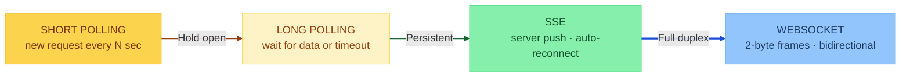

| | Short Polling | Long Polling | SSE | WebSocket |
|---|---|---|---|---|
| **Direction** | Client → Server | Client → Server | Server → Client | Bidirectional |
| **Connection** | New each time | Held until data/timeout | Persistent HTTP | Persistent TCP |
| **Overhead** | ~800 bytes/req | ~800 bytes/reconnect | Minimal | 2-14 bytes/frame |
| **Latency** | Up to N seconds | Near-instant | Near-instant | Sub-millisecond |
| **Complexity** | Trivial | Low | Low | High |

---

## Short Polling

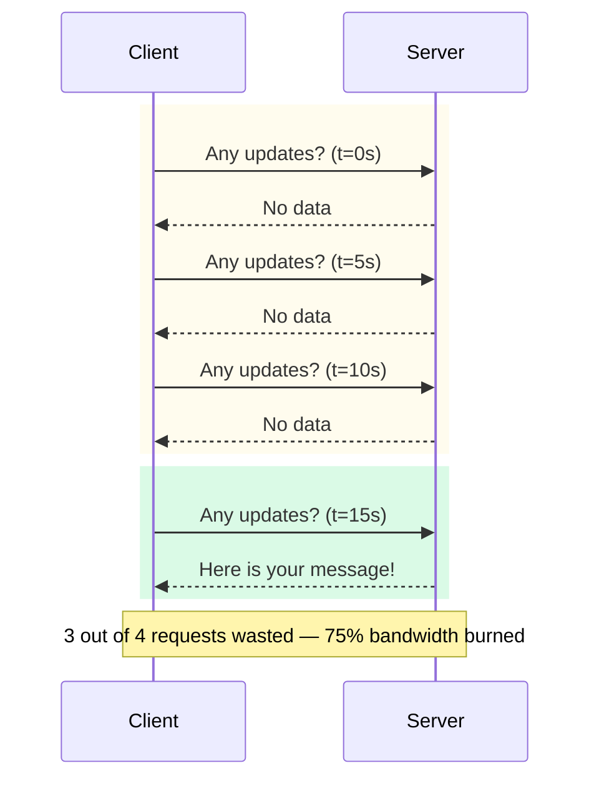

**The math that kills it:**

- 1M users × 5s interval = **200K requests/sec**
- 95% empty = **190K wasted/sec**
- ~800 bytes headers each = **152 MB/sec wasted bandwidth**

!!! failure "Only acceptable for"
    Weather updates, exchange rates — anything with > 5 min intervals. Never for real-time.

---

## Long Polling

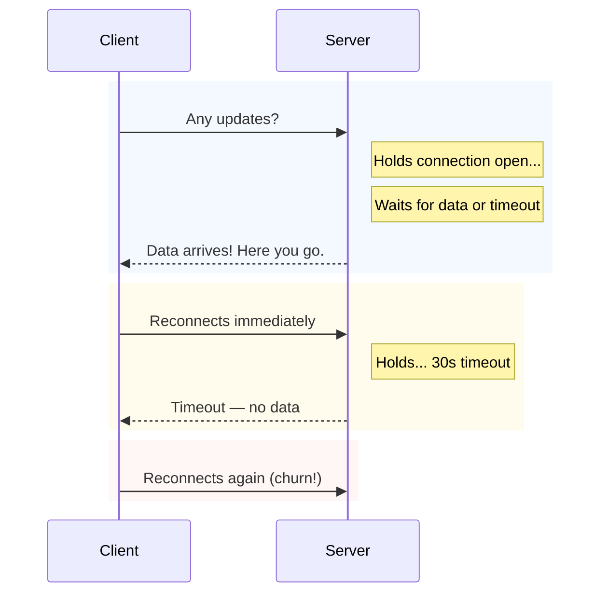

**The thundering herd problem:**

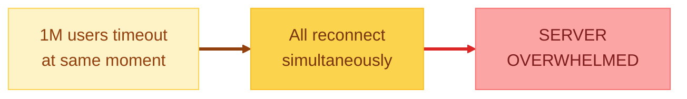

**When to use:** Fallback when WebSocket/SSE blocked by corporate firewalls.

---

## Server-Sent Events (SSE)

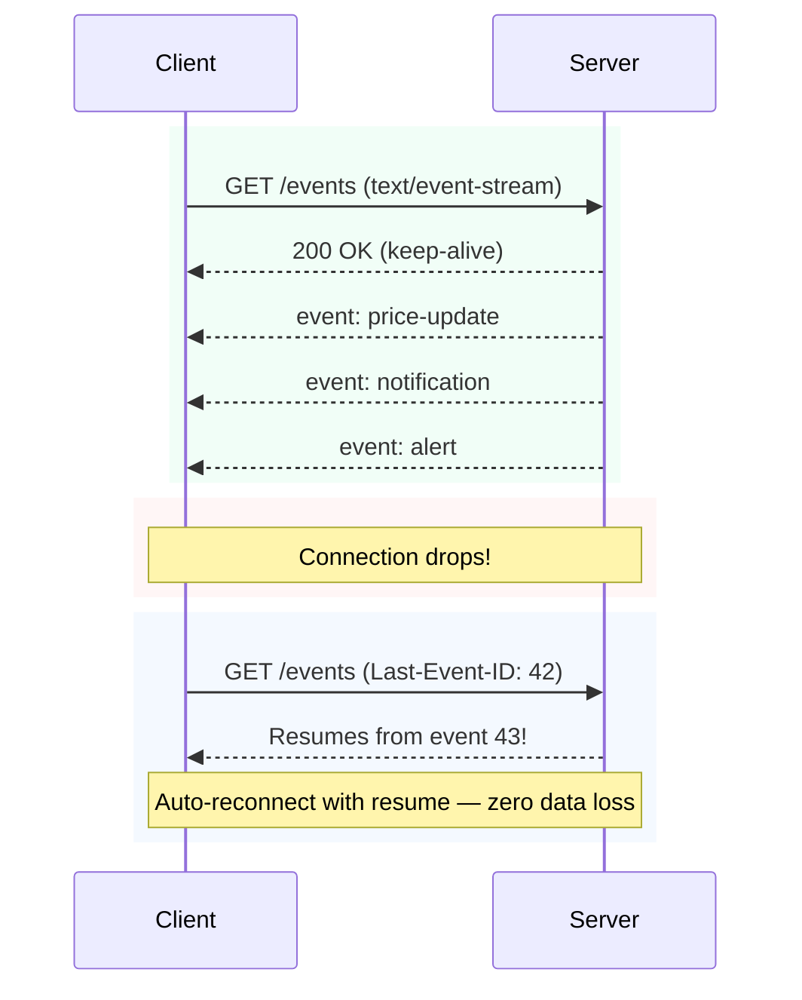

### SSE vs WebSocket — When to Choose SSE

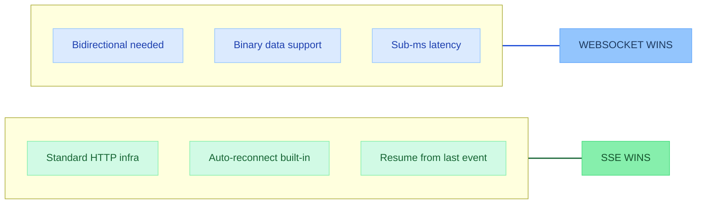

!!! tip "ChatGPT uses SSE"
    AI streaming responses are server-push only, text-based, HTTP-friendly — perfect SSE use case.

**When to use:** Notifications, live feeds, stock tickers, AI streaming, score updates.

---

## WebSocket

### The Upgrade Handshake

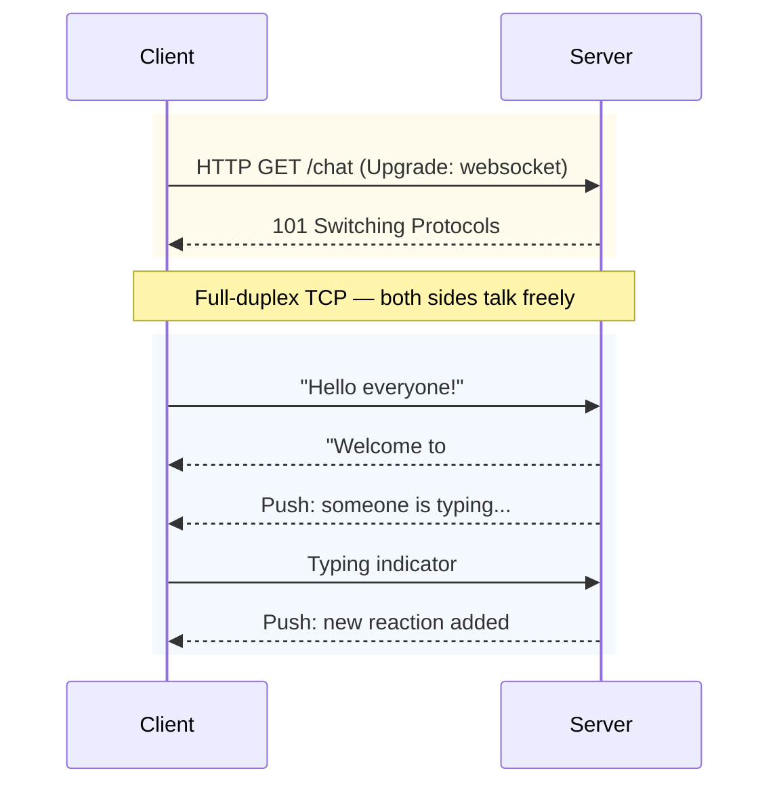

### The Overhead Difference

| | HTTP Request | WebSocket Frame |
|---|---|---|
| Header overhead | ~800 bytes | 2-14 bytes |
| To send "hello" | 805 bytes | 7 bytes |
| 1000 messages | 805 KB | 7 KB |
| **Savings** | Baseline | **~99% less** |

---

## Decision Framework

!!! abstract "The 3-Second Rule"
    **Both sides talk?** → WebSocket. **Server talks, client listens?** → SSE. **That's it.**

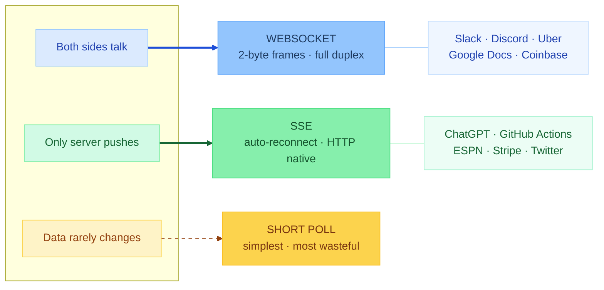

| Your System Looks Like... | Pick This | Real Examples |
|---|---|---|
| Users typing, sending, reacting in real-time | **WebSocket** | Slack, Discord, Google Docs, Uber |
| Server pushes updates, client just renders | **SSE** | ChatGPT, GitHub Actions, ESPN, Stripe |
| Data barely changes, simplicity > performance | **Short Polling** | Weather widget, dashboard refresh |

---

## Scaling WebSockets — The Hard Part

WebSocket connections are **stateful**. This changes everything about scaling.

### Multi-Server Architecture

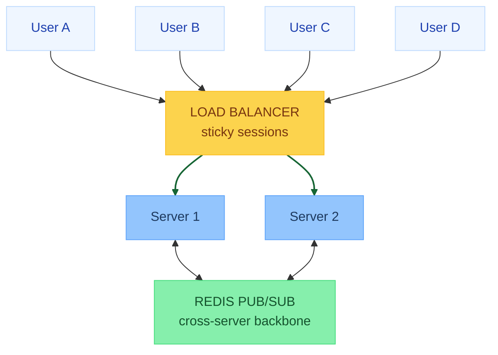

### Cross-Server Message Routing

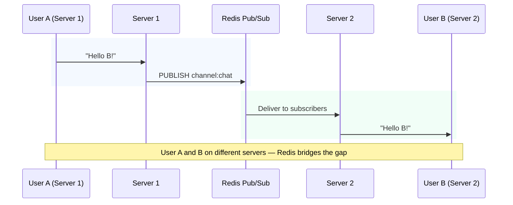

| Pub/Sub Backbone | Latency | Used By |
|---|---|---|
| Redis Pub/Sub | <1ms | Slack |
| Kafka | 5-20ms | LinkedIn |
| Custom in-memory | <0.5ms | Discord (Elixir) |

### Connection Limits

| Users | RAM (at ~40KB/conn) | Servers (100K/server) |
|---|---|---|
| 100K | ~4 GB | 1 |
| 1M | ~40 GB | 10 |
| 10M | ~400 GB | 100 |

### Reconnection Storm

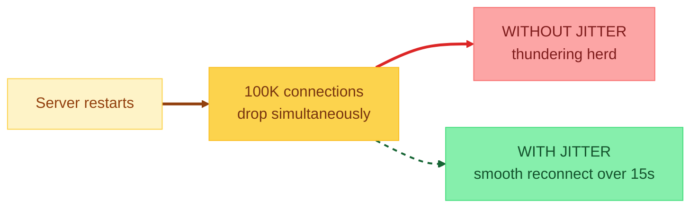

**Fix:** `delay = min(base × 2^attempt, maxDelay) + random(0, jitter)`

---

## Connection Lifecycle

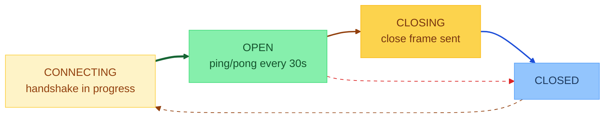

### Graceful Degradation

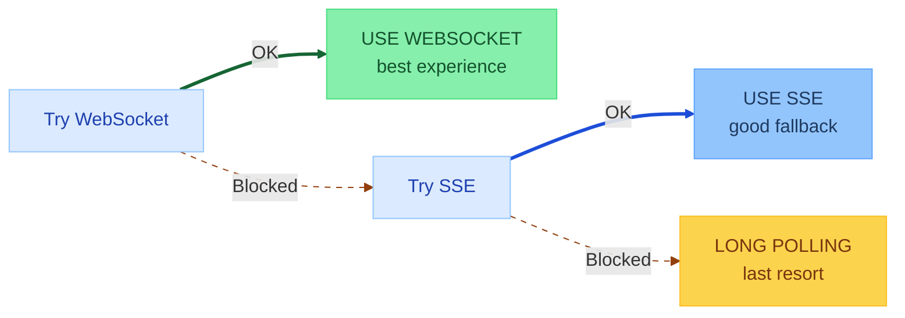

---

## Real-World Architectures

### Slack

### Discord

**Key insight:** Elixir process = ~2KB vs OS thread = ~1MB. Millions of lightweight processes per server.

### Uber (Driver Location)

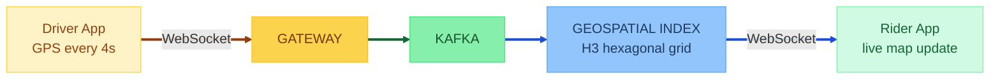

---

## HTTP/2 Push vs SSE vs WebSocket

| | HTTP/2 Push | SSE | WebSocket |
|---|---|---|---|
| Direction | Server → Client | Server → Client | Bidirectional |
| Designed for | Assets (CSS, JS) | Event streams | Real-time interactive |
| Status | **DEPRECATED** | Well-supported | Well-supported |

!!! warning "Interview Trap"
    HTTP/2 Server Push is NOT a replacement for SSE/WebSocket. It was for pushing assets and is being deprecated. Don't confuse them.

---

## Interview Answer Template

!!! abstract "How to answer real-time system design questions"

    **Step 1 — Direction:** "Communication is [bidirectional / server-push only], so [WebSocket / SSE] fits because..."

    **Step 2 — Frequency:** "Messages at [X/sec], latency needs [Y]ms. Rules out [polling] because..."

    **Step 3 — Scaling:** "With [N] concurrent connections at 100K/server, I need [N/100K] gateway servers. Cross-server routing via [Redis Pub/Sub / Kafka]."

    **Step 4 — Failures:** "Exponential backoff + jitter for reconnection. Heartbeat every 30s to detect dead connections."

    **Step 5 — Numbers:** "[N] users × 40KB = [X]GB RAM."

---

## Quick Recall

| Question | Answer |
|---|---|
| Short polling problem? | 95% empty responses, massive bandwidth waste |
| Long polling vs WebSocket? | LP reconnects per message. WS stays connected. |
| SSE vs WebSocket? | SSE = server-push only, auto-reconnect. WS = bidirectional. |
| WebSocket frame overhead? | 2-14 bytes (vs ~800 bytes HTTP) |
| Scaling challenge? | Stateful — need sticky sessions + pub/sub backbone |
| Reconnection storm fix? | Exponential backoff + jitter |
| Heartbeat purpose? | Keep alive (firewalls kill idle at 60-120s) |
| Memory per connection? | ~40KB. 1M connections = ~40GB. |
| ChatGPT streaming? | SSE — server-push, text, HTTP-friendly |
| Discord's secret? | Elixir — 2KB per process vs 1MB per thread |
